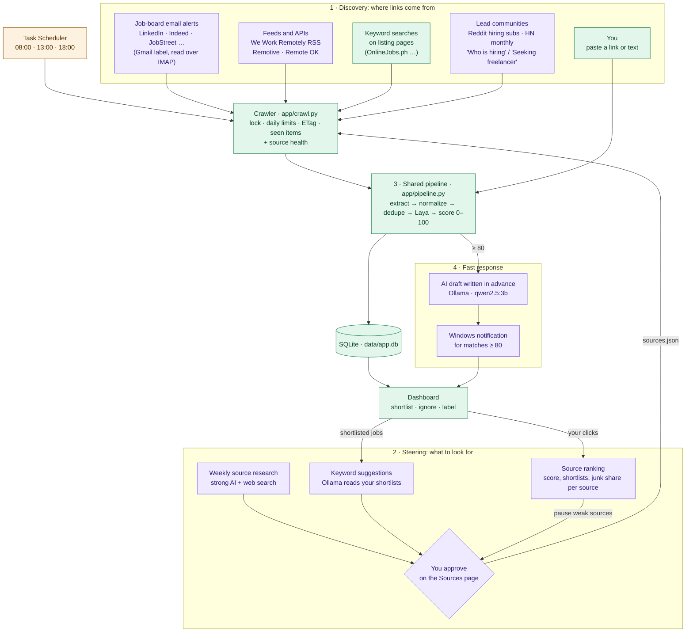

# Automated Job and Lead Discovery Plan

## Problem

The goal: set your preferences once, and good jobs and client leads keep arriving on the dashboard, scored and ready for a reply, without pasting links.

Today the app is far from that:

1. **Nobody searches.** The crawler only visits the sources you add, and only the first page of each. There is one source today (an OnlineJobs.ph search for "vibe coder"). The crawler doesn't try other keywords, sites, or later result pages.
2. **Nothing runs on its own.** The scheduled task script exists but isn't installed, so every crawl so far was started by hand.
3. **The best sites are behind a login.** LinkedIn and similar sites hide jobs from visitors. Scraping them while logged in breaks their terms and risks a ban on *your* account.
4. **Leads aren't on job boards.** People and businesses who need your services post in communities (Reddit, Hacker News), not on job boards.
5. **Sources break silently.** A dead feed or a changed layout looks exactly like "no new jobs".
6. **The scoring is noisy.** 21 of 26 opportunities are flagged *needs review* because Laya isn't confident. Adding more sources now would mostly add more noise.
7. **Slow replies lose.** On OnlineJobs.ph and Reddit, the first good reply usually wins. Right now you only see a new match when you happen to open the dashboard.

An AI agent that browses the web looking for links (OpenClaw-style) sounds like the fix, but it isn't a good one here. The local model (`qwen2.5:3b`) is too small for reliable multi-step browsing and tends to invent URLs. An agent that reads untrusted web pages while having access to your PC can also be manipulated by text hidden in those pages (prompt injection).

## Solution

Give each job to whatever does it best, and let your own clicks steer the system.

| Job | Done by | Why |
|---|---|---|
| Searching a site's jobs, including login-only sites | **The site itself, through its email alerts** | A site searches its own listings better than any scraper can. Alerts are allowed by the site's terms and need no login from the app |
| Fetching the same sources several times a day | **The crawler** (already built) | Cheap, predictable, and polite |
| Finding *new sources* (boards, subreddits, communities) | **A strong AI with web search, once a week** | Sources change rarely, so occasional research is enough. You approve every suggestion |
| Suggesting new search keywords | **Ollama**, from the jobs you shortlist | A small model is good enough for this, and it works from real data |
| Judging each job | **Laya + the score engine** (already built) | A wide net is fine when junk is filtered out |
| Deciding which sources are worth keeping | **Your shortlist and ignore clicks**, counted per source | Real results, not guesses |
| Replying fast | **A Windows notification with an AI draft already written** | Cuts the time from post to reply |

### Architecture

Green = already built. Purple = new in this plan. Amber = built but not switched on.

The loop is the point. Discovery brings links in, Laya scores them, your shortlist and ignore clicks show which sources and keywords pay off, and those results decide what gets searched next. Every new source goes through you, so nothing starts crawling without your approval.

### The parts

**Email alerts (the biggest win).** You save searches on LinkedIn, Indeed, JobStreet, and any other board that offers alerts, and send the alert emails to a Gmail label such as `job-alerts`. A new `imap` source kind reads that label with Python's built-in `imaplib` and `email` modules. Each alert email lists several jobs, so it's split into one opportunity per job:
- A small parser for each common sender (LinkedIn, Indeed, JobStreet), with a generic fallback that pairs job links with the text around them.
- If a job page may be fetched (its `robots.txt` allows it), the full posting is fetched for better scoring. Otherwise, as on LinkedIn, the job is scored from the email text, and the link opens the site in your browser.
- Emails are tracked by `Message-ID` in `seen_items`, like every other source.

**Feeds, APIs, and lead communities.** We Work Remotely's RSS works with the existing `rss` source kind today. Remotive and Remote OK each get a small source kind for their JSON APIs. For leads, add Reddit hiring subreddits (through their RSS feeds) and the Hacker News monthly threads (through the free Algolia search API).

**Source health.** Each source records its last success, last error, consecutive failures, and new items from the last run. A listing page that yields no job links counts as a failure, because that's what a login wall or a layout change looks like.

**Source ranking.** For each source: items found, average score, shortlisted, ignored, and rejected. The Sources page sorts by that and suggests pausing a source that has produced 30+ items and no shortlists.

**Keyword suggestions.** On demand, and monthly, Ollama reads the titles and descriptions of what you've shortlisted and proposes new search terms. For boards with a known search URL (OnlineJobs.ph `jobkeyword=`, Remotive `search=`), each term becomes a ready-made source suggestion.

**Weekly source research.** A script (`python -m app.research`, run weekly by Task Scheduler) asks a strong model with web search (the Claude API, for example) to find job boards, subreddits, and communities for your skills and region. It must return only sources it actually found, with URLs. Each one is checked by fetching it before it's shown to you as a suggestion. This is the only part that costs money (API credits), and running weekly keeps it small.

**Fast response.** When a crawl finds a match scoring 80 or more, the app writes an AI draft for it straight away (at most 3 per run, about 20 seconds each) and shows a Windows notification. Clicking the notification opens that opportunity with the draft ready.

**Better scoring first.** Before adding volume, label 30–50 opportunities on their detail pages and run `eval/run_eval.py` to see where Laya goes wrong. Then adjust the questions and the confidence threshold, and fix the extraction problems still visible in the data (text-encoding errors, leftover page navigation).

## Where things stand (checked 2026-09-26)

| Piece | Status |
|---|---|
| Greenhouse, Lever, RSS/Atom, and listing-page sources | Built (`app/crawl.py`) |
| Manage sources from the dashboard | Built (`/sources`, writes `sources.json`) |
| ETag / Last-Modified, seen items marked only after processing, retries | Built |
| Run lock, daily limit per source, one failing source doesn't stop the run | Built |
| Laya started for each run; pending evaluations retried | Built (`scripts/run_crawl.ps1`) |
| Title cleanup and boilerplate-free excerpts | Built (`clean_title` in `app/normalize.py`, `excerpt` filter in `app/main.py`) |
| Scheduled task | Script written (`scripts/register_task.ps1`), **not installed** |
| Email alerts, lead sources, Remotive / Remote OK | Not built |
| Source health, source ranking, keyword suggestions | Not built |
| Notifications, drafts written in advance | Not built |
| Weekly source research | Not built |

Checked by fetching on 2026-09-26: the We Work Remotely RSS feeds, the Remotive API, and the Remote OK API all respond. Remotive asks for at most 4 requests a day, a link back, and credit; Remote OK asks for a link back and credit. The Reddit feeds and the Hacker News API still need checking when they're built.

## Phases

Each phase is useful on its own and ends with a check you can see.

### Phase 0: Switch on, and make scoring trustworthy
- Install the scheduled task: `powershell -ExecutionPolicy Bypass -File scripts\register_task.ps1`
- Add 3–5 OnlineJobs.ph keyword searches from your skills, and the We Work Remotely programming feed.
- Label 30–50 opportunities, run `eval/run_eval.py`, and adjust Laya's questions and the confidence threshold.

**Done when:** crawls run without you, and fewer than a third of new items need review.

### Phase 1: Email alerts
- Add the `imap` source kind, sender parsers for LinkedIn, Indeed, and JobStreet plus the generic fallback, and scoring from the email text when a page can't be fetched.
- Add a test for each parser, using a saved example email in `tests/fixtures/`.
- You: create the Gmail label and a filter for alert senders, save a few searches on each board, and set the IMAP environment variables.

**Done when:** a LinkedIn alert email turns into scored opportunities on the next crawl.

### Phase 2: Wider sources and source health
- Add the `remotive` and `remoteok` source kinds (Remotive is capped at 4 runs a day).
- Add lead sources: Reddit hiring subreddits and the Hacker News monthly threads.
- Add the source health columns, statuses on the Sources page, and a dashboard warning after 2 failed runs in a row.

**Done when:** breaking a source's URL shows up as a warning on the dashboard, and leads from Reddit or Hacker News appear with the `lead` type.

### Phase 3: Steering from your clicks
- Add source ranking on the Sources page, and suggestions to pause weak sources.
- Add keyword suggestions from your shortlists, turned into one-click source suggestions.

**Done when:** the Sources page shows which sources bring shortlisted jobs, and a suggested keyword can be added as a source with one click.

### Phase 4: Fast response
- Write AI drafts in advance for matches scoring 80 or more (at most 3 per run).
- Show a Windows notification through the WinRT toast API, called from `scripts/run_crawl.ps1`. No new dependencies.
- The threshold is a setting on the Profile page.

**Done when:** a strong match found by a scheduled crawl raises a notification that opens the opportunity with its draft ready.

### Phase 5: Weekly source research
- Add `app/research.py` and a weekly scheduled task. Suggestions appear on the Sources page for approval.
- Every suggested URL is fetched and checked before it's shown. The API key is stored in an environment variable.

**Done when:** a weekly run adds at least one real, working source suggestion that you haven't seen before.

## Deferred, and when to revisit

| Idea | Why not now | Revisit when |
|---|---|---|
| A resident AI agent that browses for links | Small local models invent URLs and browse unreliably, and agents that read the open web can be prompt-injected. Email alerts and weekly research cover the same need | A strong model can run locally, and the agent's permissions can be locked down |
| Browser automation (Playwright) | Adds ~150 MB of browsers and breaks on layout changes. Email alerts cover most login-only sites | A valuable board has no alerts, feed, or usable listing page |
| Scraping while logged in | Against most sites' terms, and the ban lands on your account | Probably never; use the site's alerts instead |
| Hosted, always-on collection | Laya and Ollama would have to be hosted too | Missing jobs while the PC is off actually costs you opportunities |
| Following "next page" links on listings | Keyword searches already vary what the first page shows | A source's first page regularly fills up between crawls |

## Requirements

- **The PC is on and you're logged in to Windows** at the scheduled times. Runs missed while it was off or asleep happen when it comes back.
- **Laya** installed; the crawl script starts it. If it's down, items wait as pending and are scored later.
- **Ollama with `qwen2.5:3b`** for keyword suggestions and drafts written in advance. Everything else works without it.
- **For email alerts:** a Gmail account (a separate one just for alerts is best) with IMAP turned on, and an app password (this needs 2-Step Verification). It's stored in environment variables (`IMAP_HOST`, `IMAP_USER`, `IMAP_PASSWORD`), never in the database or the repository. You set these up yourself.
- **For weekly research:** an API key for a model with web search, stored as an environment variable. This is the only part that costs money.
- **No new Python packages.** IMAP, email parsing, and notifications all use the standard library or what's already installed.
- **Respect each source's terms:** Remotive at most 4 requests a day, link-back and credit for Remotive and Remote OK, `robots.txt` for every page fetched.
