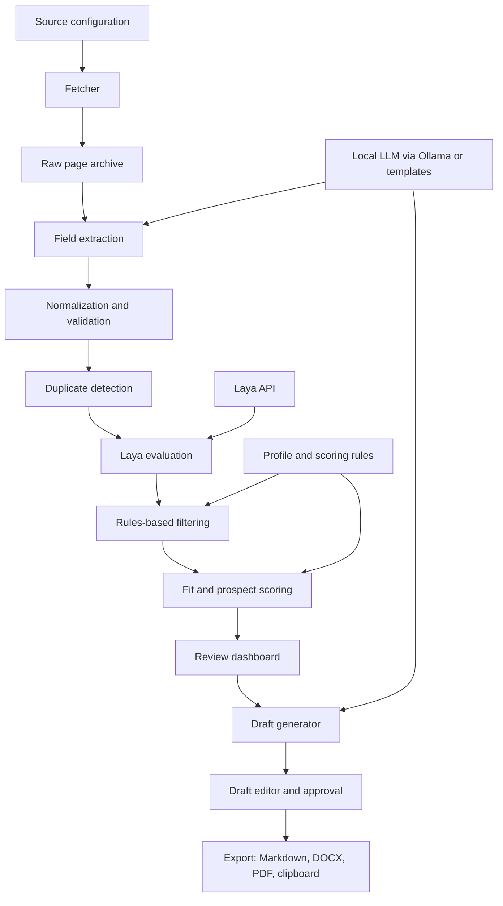

# Local Job and Lead Crawler

## Product goal

Build a local-first application that discovers job and business-lead opportunities, turns web pages into structured records, removes duplicates, filters and ranks prospects, and prepares tailored job-application or lead-outreach drafts for human review.

The system should make recommendations and drafts. It should not automatically submit applications or send messages without explicit human approval.

## High-level architecture



The pipeline is split into deterministic stages and model-assisted stages:

- **Ordinary code:** fetching, storage, normalization, duplicate checks, hard filters, and final score arithmetic.
- **Laya:** answers typed questions about an opportunity (which type, how relevant, is it spam). Laya does not extract fields or write text.
- **A generative model or templates:** fallback field extraction and draft writing.

## Main components

### 1. Source manager

Stores the sites and feeds that are allowed to be fetched.

Each source should define:

- URL, feed URL, or API endpoint;
- source type: job board, company careers page, directory, or lead page;
- access method: official API, RSS/Atom feed, or HTML page;
- fetch frequency (default: every scheduled run; can be lowered per source, see "Scheduled runs");
- allowed domains and URL patterns;
- CSS or XPath selectors when a site needs custom extraction;
- status and last successful run.

**Prefer sources with official, machine-readable access.** They are allowed, stable, and already structured, which removes most of the extraction problem:

- Greenhouse, Lever, Ashby, and Workable public job-board APIs (many companies' careers pages run on these);
- RSS/Atom feeds from job boards and company blogs;
- public APIs such as RemoteOK and the Hacker News "Who is hiring?" threads;
- manually pasted text and URLs.

Do not scrape sites whose terms forbid it (for example LinkedIn, Indeed, and Glassdoor). Record each source's terms decision in the source configuration.

### 2. Fetcher

Fetches pages and feeds responsibly and records the original URL, timestamp, HTTP status, and raw body. It must respect robots.txt, per-domain rate limits, site terms, and retry limits, and send an honest User-Agent.

Use a queue so a failed page does not stop the run. Store raw pages locally so extraction can be improved without downloading the same pages again.

#### Scheduled runs

Runs happen **at least three times a day**, by default at 08:00, 13:00, and 18:00 local time. The times are configurable.

- **Trigger:** Windows Task Scheduler runs `scripts/run_crawl.ps1`, which calls `python -m app.crawl`. The crawl is a command-line entry point, so it works whether or not the dashboard is open.
- **Missed runs:** the task is set to "run as soon as possible after a scheduled start is missed", so a run skipped while the PC was asleep or off happens at the next startup. Waking the PC for runs is optional.
- **One run at a time:** a lock file stops a new run from starting while the previous one is still going.
- **Per-source frequency:** a source can opt out of some runs (for example, once a day) when its terms or rate limits call for it. Three runs a day is the ceiling for a source, not a requirement.
- **Incremental fetching:** use `ETag` / `If-Modified-Since` and feed item IDs so repeat runs only fetch new or changed items.
- **Laya availability:** the run starts Laya if it is not running and waits for `/health`. If Laya still is not available, new opportunities are stored as "pending evaluation" and evaluated on the next run instead of being lost.
- **Run log:** each run records start and end time, sources fetched, new items, duplicates, errors, and items pending evaluation in `crawl_runs`. The dashboard shows the last run's status and highlights new items since the user's last visit.

### 3. Extractor

Converts raw content into a common opportunity record. It should extract, where available:

- title;
- company or organization;
- description;
- source URL;
- contact name, email, or phone;
- location and remote status;
- salary, budget, or project value;
- skills, services, and keywords;
- deadline and publication date.

Extraction order, cheapest and most reliable first:

1. **Structured sources:** map API or feed fields directly.
2. **Embedded metadata:** many job pages include schema.org `JobPosting` JSON-LD; parse it before touching the HTML.
3. **Site-specific selectors** for configured sources.
4. **LLM fallback:** send the cleaned page text to a local model (Ollama) with a fixed JSON schema, and validate the result with Pydantic. Mark every field it produced as `extracted_by: llm` so it can be checked.

Fields that cannot be found stay empty with a warning. Never guess. Preserve the original text alongside extracted fields for traceability.

### 4. Cleaner and normalizer

Normalizes whitespace, URLs, email addresses, phone numbers, company names, dates, currencies, and location names. It should validate fields and record warnings instead of silently discarding data.

### 5. Duplicate detector

Use several signals together:

- canonical URL match;
- identical email or phone number;
- normalized company and title match;
- description similarity;
- source repost detection.

Mark records as duplicates with a link to the original. Keep the raw record for auditability.

### 6. Laya evaluation

Call the local Laya server after extraction and cleaning. Laya answers three kinds of questions (`choice`, `score`, and yes/no), each with probabilities and a confidence value. Useful questions:

- **type** (choice): job, freelance project, business lead, partnership opportunity, agency or recruiter, spam, irrelevant;
- **relevance** (score): how well the opportunity matches the profile's skills and services;
- **lead intent** (choice): actively hiring or buying, exploring, or no clear intent;
- **seniority** or **work mode** (choice) when the extractor did not find them.

Question wording and categories live in the user profile, not in code.

Integration rules:

- **Send all questions for one opportunity in a single request.** One request with several questions is much cheaper than several requests.
- **Use `answer_confidence`, not `confidence`.** `answer_confidence` is calibrated (answers at 0.9 are right about 90% of the time). `confidence` is an entropy measure on a different scale.
- **Call `http://127.0.0.1:8000`, not `localhost`.** On Windows, `localhost` tries IPv6 first; Laya listens on IPv4 only, which adds about 2 seconds to every call.
- **Keep the input under Laya's limits:** 50,000 characters of state and 64 questions per request. Send the cleaned description, not raw HTML.
- **Route low-confidence answers to review.** Below a configurable `answer_confidence` threshold, show the record as "needs review" instead of trusting the label.
- **Measure before trusting.** The base Laya model is reported to be close to random on tasks it was not fine-tuned for. The evaluation set in Phase 1 decides whether the labels are good enough or whether fine-tuning is needed.

Laya server settings for this machine (GTX 1650, 4 GB): `LAYA_DEVICE=cuda` and `LAYA_MODELS=english` to load only the English checkpoint and leave GPU memory free. Add `multilingual` only if non-English opportunities are expected.

### 7. Filter and scoring engine

Hard rules run first: excluded locations, minimum budget or salary, required contact information, blocked industries, duplicate status, and Laya type (drop spam and irrelevant).

**Phase 1 score:** Laya relevance score, adjusted by simple deterministic checks (skill keyword overlap, salary within range, location fit). Keep it simple until there is labeled data to tune against.

**Later score:** a weighted formula, with weights tuned against the evaluation set rather than chosen up front. A starting point:

```text
final_score =
  40% skill or service match
  20% budget or salary fit
  15% opportunity relevance
  10% location and work-mode fit
  10% freshness and urgency
   5% contact quality and model confidence
```

Keep every component score and the reason behind it. A user should be able to see why an opportunity ranked highly.

### 8. Local review dashboard

The dashboard should provide:

- a list of opportunities sorted by score;
- filters for type, score, source, location, status, and date;
- a detail view with source link and extracted data;
- duplicate and classification status, with a "needs review" flag for low-confidence labels;
- score breakdown and reasons;
- buttons to ignore, save, shortlist, correct a label, or create a draft;
- a clear human-review state before any export or external action.

Label corrections are saved and feed the evaluation set.

### 9. Draft generator

Generate one of two draft types:

- tailored job application or proposal;
- tailored business lead email.

Draft inputs are the opportunity, the user's profile, relevant experience, preferred tone, and selected evidence. The first version uses templates; a local model through Ollama comes in Phase 3. Drafts are saved as editable records and are never sent automatically.

## Data model

Use SQLite as the source of truth.

**Phase 1 tables:**

- `opportunities`: normalized fields, raw text, source URL, duplicate link, status;
- `evaluations`: Laya answers, `answer_confidence`, question-set version, model name, timestamp, score components, and reasons;
- `drafts`: draft text, type, status, and timestamps;
- `crawl_runs`: start and end time, sources fetched, new items, duplicates, pending evaluations, and errors.

Sources are listed in a `sources.json` file in Phase 1. The profile is a JSON file in Phase 1 (skills, services, locations, rates, preferences, and Laya question wording).

**Added in later phases:** `sources`, `raw_pages`, `opportunity_tags`, `duplicates` (for similarity-based matches with confidence), `profiles` (when a profile editor exists), and draft revision history.

Every model-assisted result records the model name, question-set version, timestamp, and confidence so results can be reproduced and reviewed.

## Personal data

Lead records can contain personal data, which falls under GDPR and similar laws.

- Store business contact details only (work email, company phone, role). Do not collect personal social profiles, home addresses, or private numbers.
- Record where each contact detail came from.
- Delete ignored or rejected records containing personal data after a set retention period (default 90 days).
- Provide a way to delete every record for a given person or email address.
- Keep the database local and out of git.

## Recommended local tech stack

### Backend

- Python 3.12 or newer;
- FastAPI for the local API, on a port other than 8000 (Laya uses 8000), for example 8100;
- Pydantic for request and record validation;
- the standard library `sqlite3` module in Phase 1; move to SQLModel or SQLAlchemy only if the schema grows enough to need migrations;
- httpx and selectolax (or BeautifulSoup) for pages and feeds;
- `feedparser` for RSS/Atom;
- Playwright only for configured sources that require JavaScript (Phase 2).

### Model services

- Laya at `http://127.0.0.1:8000` for classification and scoring;
- Ollama with a small local model for fallback extraction and, later, drafting;
- optional sentence-transformers embeddings for semantic duplicate detection and skill matching (Phase 3).

### Frontend

- **Phase 1:** FastAPI with server-rendered HTML (Jinja2 templates) and a little plain JavaScript. The existing Laya test interface (`Desktop\Laya\ui`) shows the pattern.
- **Later, if the interface outgrows it:** React with Vite and TypeScript. The API stays the same, so the frontend can be replaced without backend changes.

### Operations and testing

- PowerShell scripts to start Laya, Ollama, and the app on Windows;
- Windows Task Scheduler for scheduled fetch runs, at least three times a day (Phase 1);
- no Docker: everything runs natively in a Python virtual environment (see "Decisions to preserve");
- `.env` for local configuration;
- pytest for extraction, deduplication, scoring, and API tests;
- JSON or Markdown exports for backups and inspection.

## Application flow

### Fetch flow

1. The user selects sources or pastes URLs or text.
2. The fetcher creates a run and queues URLs.
3. Pages and feeds are fetched with rate limits and archived.
4. The extractor creates candidate opportunity records.
5. The cleaner normalizes and validates fields.
6. The duplicate detector links repeated records.
7. New records are sent to Laya in one request each.
8. Hard filters remove records outside the user's requirements.
9. The scoring engine calculates fit or prospect scores.
10. The dashboard displays the ranked results, with low-confidence labels flagged.

### Review and drafting flow

1. The user opens a ranked opportunity.
2. The dashboard shows the source, extracted facts, score breakdown, and Laya confidence.
3. The user corrects fields or labels if necessary; corrections are saved for evaluation.
4. The user clicks **Create draft** and selects job application or lead email.
5. The draft generator uses only the selected opportunity data and the user's profile.
6. The user edits and approves the draft.
7. The system exports the draft or copies it to the clipboard.

## Build phases

### Phase 1: Working local MVP

- SQLite schema (three tables) and JSON profile;
- paste text or a single URL;
- extraction from JSON-LD and basic HTML;
- normalization and URL-based deduplication;
- Laya evaluation through `/v1/systemone`, one request per opportunity;
- **evaluation set:** 30–50 real opportunities labeled by hand, and a script that reports Laya's accuracy per question;
- hard filters and the simple Phase 1 score;
- server-rendered dashboard;
- template-based Markdown draft export;
- scheduled crawl at least three times a day over a short `sources.json` list (RSS feeds and Greenhouse/Lever boards), with missed-run catch-up, a run lock, `pending_evaluation` when Laya is down, and a `crawl_runs` log.

**Exit check:** Laya's accuracy on the evaluation set is good enough to rank by. If it is not, fine-tune Laya on the labeled set, or replace that question with a rule, before Phase 2.

### Phase 2: Reliable collection

- source configurations managed in the dashboard (replacing `sources.json`), with more source types;
- fetch queue with per-domain rate limits;
- custom selectors;
- LLM fallback extraction through Ollama;
- Playwright for sources that need it;
- stronger duplicate similarity;
- run logs and retry handling.

### Phase 3: Better ranking and drafting

- profile editor;
- skill and service matching;
- embeddings for semantic similarity;
- weighted score formula tuned on the evaluation set;
- local drafting model;
- DOCX and PDF export;
- draft version history.

### Phase 4: Operational polish

- review states and saved searches;
- import and export backups;
- source health monitoring;
- larger evaluation datasets for extraction, classification, duplicates, and ranking;
- optional integrations with approved CRM or email tools, kept behind explicit user confirmation.

## First implementation target

The first demonstrable version accepts pasted opportunity text or a URL, saves it to SQLite, detects URL duplicates, asks Laya its questions in one request, calculates a fit score, displays the result in a local dashboard, and generates an editable Markdown draft. Alongside it, a labeled evaluation set measures whether Laya's answers are good enough, and a scheduled crawl runs the same pipeline at least three times a day over a few feeds. This validates the complete workflow, and the model's accuracy, before investing in broad collection.

## Decisions to preserve

- Keep raw source content and normalized fields together.
- Keep model output separate from the final score.
- Record reasons for every classification and ranking decision.
- Measure model accuracy on labeled data before relying on it.
- Make all external actions manual and explicit.
- Use local services and local storage by default.
- Run natively on Windows, without Docker. Laya uses the local NVIDIA GPU directly, and GPU passthrough in Docker on Windows adds setup without benefit for a single-user local app. Revisit only when moving to a server or sharing the app with other users.
- Prefer official APIs and feeds over scraping; treat source terms, robots.txt, rate limits, and personal-data handling as part of the design.
