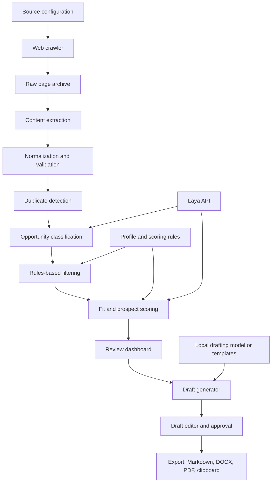

# Local Job and Lead Crawler

## Product goal

Build a local-first application that discovers job and business-lead opportunities, turns unstructured web pages into structured records, removes duplicates, filters and ranks prospects, and prepares tailored job-application or lead-outreach drafts for human review.

The system should make recommendations and drafts. It should not automatically submit applications or send messages without explicit human approval.

## High-level architecture



The pipeline is split into deterministic stages and model-assisted stages. Crawling, storage, normalization, duplicate checks, and basic filters should be ordinary code. Laya should classify and evaluate opportunities. Draft generation should be handled by a separate language model or a template system.

## Main components

### 1. Source manager

Stores the sites and feeds that are allowed to be crawled.

Each source should define:

- URL or starting URL;
- source type: job board, company site, directory, or lead page;
- crawl frequency;
- allowed domains and URL patterns;
- CSS or XPath selectors when a site needs custom extraction;
- crawl status and last successful run.

The first version should support manually added URLs and a small number of configured sources. Broad uncontrolled crawling can be added later.

### 2. Crawler

Fetches pages responsibly and records the original URL, timestamp, HTTP status, and raw HTML. It should respect robots.txt, rate limits, site terms, and retry limits.

Use a queue so a failed page does not stop the complete crawl. Store raw pages locally so extraction rules can be improved without downloading the same pages repeatedly.

### 3. Extractor

Converts raw pages into a common opportunity record. It should extract, where available:

- title;
- company or organization;
- description;
- source URL;
- contact name, email, or phone;
- location and remote status;
- salary, budget, or project value;
- skills, services, and keywords;
- deadline and publication date.

Extraction should use site-specific selectors first, then a general fallback parser. Preserve the original text alongside extracted fields for traceability.

### 4. Cleaner and normalizer

Normalizes whitespace, URLs, email addresses, phone numbers, company names, dates, currencies, and location names. It should validate fields and record warnings instead of silently discarding data.

### 5. Duplicate detector

Use several signals together:

- canonical URL match;
- identical email or phone number;
- normalized company and title match;
- description similarity;
- source repost detection.

Mark records as duplicates with a link to the original. Keep the raw record for auditability.

### 6. Laya classifier

Call the local Laya server after extraction and cleaning. Laya can classify:

- job;
- freelance project;
- business lead;
- partnership opportunity;
- agency or recruiter;
- spam;
- irrelevant result.

It can also classify lead intent and return probabilities and confidence. Example categories should be configured in the user profile rather than hard-coded throughout the application.

### 7. Filter and scoring engine

Rules should handle hard requirements such as excluded locations, minimum budget, required contact information, blocked industries, and duplicate status.

The scoring engine should combine deterministic values with model output. A starting formula is:

```text
final_score =
  40% skill or service match
  20% budget or salary fit
  15% opportunity relevance
  10% location and work-mode fit
  10% freshness and urgency
   5% contact quality and model confidence
```

Keep every component score and the reasons used to calculate it. A user should be able to understand why an opportunity ranked highly.

### 8. Local review dashboard

The dashboard should provide:

- a list of opportunities sorted by score;
- filters for type, score, source, location, status, and date;
- a detail view with source link and extracted data;
- duplicate and classification status;
- score breakdown and reasons;
- buttons to ignore, save, shortlist, or create a draft;
- a clear human-review state before any export or external action.

### 9. Draft generator

Generate one of two draft types:

- tailored job application or proposal;
- tailored business lead email.

Draft inputs should include the opportunity, the user's profile, relevant experience, preferred tone, and selected evidence. Drafts should be saved as editable records and should never be sent automatically.

## Data model

Use SQLite as the source of truth. Core tables:

- `sources`: configured websites and crawl settings;
- `crawl_runs`: start time, end time, status, and error summary;
- `raw_pages`: URL, HTML or text archive, hash, and crawl timestamp;
- `opportunities`: normalized opportunity records;
- `opportunity_tags`: skills, industries, and categories;
- `duplicates`: duplicate relationships and confidence;
- `evaluations`: Laya output, score components, model version, and reasons;
- `profiles`: user skills, services, locations, rates, and preferences;
- `drafts`: draft text, type, status, and revision history.

Every model-assisted result should record the model name, prompt or criteria version, timestamp, and confidence so results can be reproduced and reviewed.

## Recommended local tech stack

### Backend

- Python 3.12 or newer;
- FastAPI for the local API;
- Pydantic for request and record validation;
- SQLModel or SQLAlchemy with SQLite;
- Playwright for JavaScript-rendered pages;
- httpx and BeautifulSoup or selectolax for ordinary pages;
- APScheduler or a simple background worker for scheduled crawls.

### Model services

- Laya running locally at `http://localhost:8000` for classification and evaluation;
- a separate local drafting model through Ollama, or a template-based generator for the first version;
- optional sentence-transformers embeddings for semantic duplicate detection and skill matching.

### Frontend

- React with Vite and TypeScript for the dashboard;
- Tailwind CSS for a fast local interface;
- TanStack Query for API state and refreshes;
- a simple table and detail panel before adding complex visualizations.

### Operations and testing

- PowerShell scripts for Windows startup;
- `.env` for local configuration;
- pytest for extraction, deduplication, scoring, and API tests;
- Playwright tests for the dashboard's critical review flow;
- JSON or Markdown exports for backups and inspection.

If a smaller first version is preferred, use FastAPI plus server-rendered HTML or Streamlit before introducing React. The database and API boundaries should remain the same so the interface can be replaced later.

## Application flow

### Crawl flow

1. The user selects sources or enters URLs.
2. The crawler creates a crawl run and queues URLs.
3. Pages are fetched with rate limits and archived.
4. The extractor creates candidate opportunity records.
5. The cleaner normalizes and validates fields.
6. The duplicate detector links repeated records.
7. New records are sent to Laya for classification.
8. Hard filters remove records outside the user's requirements.
9. The scoring engine calculates fit or prospect scores.
10. The dashboard displays the ranked results.

### Review and drafting flow

1. The user opens a ranked opportunity.
2. The dashboard shows the source, extracted facts, score breakdown, and Laya confidence.
3. The user corrects fields or changes the opportunity type if necessary.
4. The user clicks **Create draft** and selects job application or lead email.
5. The draft generator uses only the selected opportunity data and the user's profile.
6. The user edits and approves the draft.
7. The system exports the draft or copies it to the clipboard.

## Build phases

### Phase 1: Working local MVP

- SQLite schema;
- manual URL import;
- basic HTML extraction;
- normalization and URL-based deduplication;
- Laya classification through its existing `/v1/systemone` endpoint;
- configurable score formula;
- simple local dashboard;
- Markdown draft export.

### Phase 2: Reliable collection

- source configurations;
- crawl queue and scheduled runs;
- Playwright support;
- custom selectors;
- stronger duplicate similarity;
- crawl logs and retry handling.

### Phase 3: Better ranking and drafting

- profile editor;
- skill and service matching;
- embeddings for semantic similarity;
- score explanations;
- local drafting model;
- DOCX and PDF export;
- draft version history.

### Phase 4: Operational polish

- review states and saved searches;
- import and export backups;
- source health monitoring;
- evaluation datasets for measuring extraction, classification, duplicate, and ranking quality;
- optional integrations with approved CRM or email tools, kept behind explicit user confirmation.

## First implementation target

The first demonstrable version should accept a URL or pasted opportunity text, save it to SQLite, detect duplicates, call Laya, calculate a fit score, display the result in a local dashboard, and generate an editable Markdown draft. This validates the complete workflow before investing in broad crawling and more advanced models.

## Decisions to preserve

- Keep raw source content and normalized fields together.
- Keep model output separate from the final score.
- Record reasons for every classification and ranking decision.
- Make all external actions manual and explicit.
- Use local services and local storage by default.
- Treat source terms, robots.txt, rate limits, and personal-data handling as part of the crawler design.
