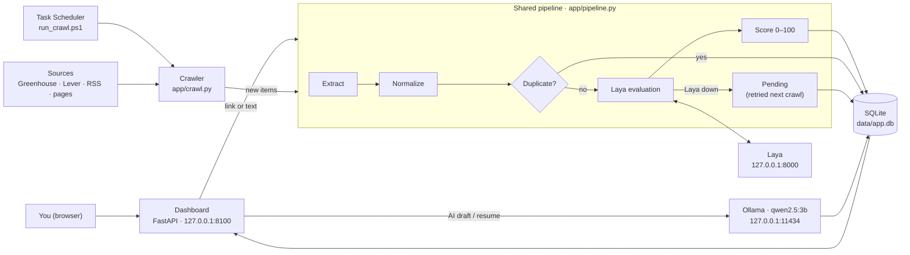

# Lead-Job-Crawler

A local web app that finds jobs and client leads, scores each one against your profile, and helps you write the reply. Everything runs on your own PC: the dashboard, the database, and both AI models. Nothing is sent anywhere except the requests that fetch job sources.

- **Collect:** paste a link or the text of a post, or let the crawler check job boards, feeds, and APIs on a schedule.
- **Clean:** pull out the title, company, location, salary, employment type, and date; fix messy titles; drop duplicates.
- **Evaluate:** [Laya](#laya-scoring) answers questions about each post (what kind of opportunity it is, how well it matches your skills, whether it's remote), and a scoring engine turns those answers plus your preferences into a 0–100 score.
- **Review:** browse the best matches first, shortlist or ignore them, and correct Laya when it's wrong.
- **Reply:** generate a job application or lead email from a template or with a local AI model (Ollama), then edit it before sending it yourself.

## Contents

- [Requirements](#requirements)
- [Setup](#setup)
- [Running it](#running-it)
- [Using the dashboard](#using-the-dashboard)
- [Crawler and sources](#crawler-and-sources)
- [How scoring works](#how-scoring-works)
- [AI drafts](#ai-drafts-ollama)
- [Configuration](#configuration)
- [Architecture](#architecture)
- [Project layout](#project-layout)
- [Tests and evaluation](#tests-and-evaluation)
- [Privacy](#privacy)
- [Troubleshooting](#troubleshooting)

## Requirements

| What | Needed for | Notes |
|---|---|---|
| Windows 10/11 | Everything | The scripts are PowerShell; the Python app itself is cross-platform |
| Python 3.14 | The app | Installed into the project's `.venv` |
| [Laya](#laya-scoring) | Scoring | A separate local project, expected at `%USERPROFILE%\Desktop\Laya` (override with `LAYA_PYTHON`). Runs on `cuda` by default |
| [Ollama](https://ollama.com) with `qwen2.5:3b` | AI drafts and filling the profile from a resume | Optional. Template drafts work without it |
| Internet access | Fetching postings and sources | |

Python packages (`requirements.txt`): `fastapi`, `uvicorn`, `jinja2`, `python-multipart`, `httpx`, `feedparser`, `pypdf`, `pytest`.

## Setup

```powershell
# 1. Create the virtual environment and install packages
py -3.14 -m venv .venv
.venv\Scripts\python.exe -m pip install -r requirements.txt

# 2. Optional: the model used for AI drafts (about 1.9 GB)
ollama pull qwen2.5:3b
```

Then start the app (below), open the **Profile** page, and either upload your resume or fill in the form. The dashboard's **Finish setting up** card lists anything still missing.

## Running it

```powershell
powershell -ExecutionPolicy Bypass -File scripts\start.ps1
```

This starts Laya if it isn't already running, checks whether Ollama and the draft model are available (it warns instead of failing), and serves the dashboard at **http://127.0.0.1:8100**. Stop it with Ctrl+C.

If Laya can't start, the app still runs: new opportunities are saved as *pending evaluation* and scored later.

## Using the dashboard

The pages are in the sidebar (a bottom tab bar on phones). The app has light and dark themes and follows your system setting.

### Dashboard `/`
- A **quick add** box: paste a link to fetch and score it right away.
- Counts of active, shortlisted, needs-review, and pending opportunities; each one links to that filtered list.
- **Top new matches**, best score first.
- The **Crawler** card: when the last run happened, what it found, and any errors.
- **Recent drafts**, plus a setup checklist until your profile is complete.

### Opportunities `/opportunities`
- Every opportunity with its score ring, source, a short excerpt, and chips (type, status, *needs review*, *rejected*).
- Tabs: All, New, Shortlisted, Needs review, Pending, Ignored.
- Filters: type, employment type, and whether to show rejected items.
- Shortlist (★) or ignore (✕) straight from the list.

### Opportunity detail `/opportunities/{id}`
- The full description, the score with the reasons behind it, Laya's answers with their confidence, and the extracted details.
- **Shortlist / Ignore / Move back to new**, **Delete**, **Re-evaluate** (asks Laya again).
- **Write a reply:** template drafts, or **AI job application** / **AI lead email**.
- **Correct Laya:** label the type, work mode, and whether it's relevant. The labels feed the [evaluation script](#tests-and-evaluation).

### Add `/add`
- Paste a **link** (fetched once, only if the site's `robots.txt` allows it) or the **text** of a post (first line = title). Use text for pages that need JavaScript or a login.
- If the link is a page that lists many jobs, the app shows the jobs it found and you pick which ones to add. They're fetched one at a time with a pause between requests.

### Profile `/profile`
- **About you:** name, headline, experience and achievements, skills, services you offer.
- **Work preferences:** work mode (remote / hybrid / on-site), employment types, preferred and excluded locations, minimum salary and currency, blocked words.
- **Notify at score** (default 80): new crawled matches at least this good get an AI draft (up to 3 per crawl) and a Windows notification.
- **Resume:** upload a PDF, Word (.docx), or text file up to 5 MB. Ollama reads it and fills in the form for you to review; nothing is saved until you click **Save profile**. The resume text is kept in the database so AI drafts can use your full history. You can delete it at any time.

### Sources `/sources`
- Add, pause, resume, and delete the sources the crawler checks. See [Crawler and sources](#crawler-and-sources).
- **Health** for each source: *Healthy · N new last run*, *Failing N runs* with the error, *Not run yet*, *Paused*, or *Daily limit reached*. The dashboard warns when a source has failed 2 crawls in a row.
- **Results** for each source: jobs found, average score, and how many you shortlisted, ignored, or had rejected. Sources are sorted by results, and one with 30+ jobs and no shortlists gets a hint to pause it.
- **Suggested sources:** **Suggest searches from my shortlist** asks Ollama for search terms based on the jobs you shortlisted, and turns them into ready-made OnlineJobs.ph and Remotive searches. Nothing is added until you click **Add**; a dismissed suggestion doesn't come back.

### Drafts `/drafts/{id}`
An editor for each saved draft. AI drafts are marked **AI**. Download any draft as Markdown from `/drafts/{id}.md`. The app never sends anything; you copy the text and send it yourself.

### Export labels `/labels.jsonl`
Downloads your corrections as JSON Lines for `eval/run_eval.py`.

## Crawler and sources

The crawler (`app/crawl.py`) checks every configured source, processes new items through the same pipeline as the dashboard, and retries anything still pending evaluation.

### Source types

Manage these on the Sources page. They're stored in `sources.json`:

```json
[
  {"kind": "greenhouse", "board": "acme"},
  {"kind": "lever", "board": "acme"},
  {"kind": "rss", "url": "https://weworkremotely.com/categories/remote-programming-jobs.rss"},
  {"kind": "page", "url": "https://www.onlinejobs.ph/jobseekers/jobsearch?jobkeyword=vibe+coder",
   "name": "Vibe Coder", "max_runs_per_day": 3},
  {"kind": "remotive", "url": "https://remotive.com/api/remote-jobs?category=software-dev&search=python"},
  {"kind": "remoteok", "url": "https://remoteok.com/api"},
  {"kind": "hn", "thread": "who_is_hiring"},
  {"kind": "imap", "label": "job-alerts"}
]
```

| Kind | Reads | Notes |
|---|---|---|
| `greenhouse` | Greenhouse job-board API (`boards.greenhouse.io/<board>`) | Only lists jobs at that company |
| `lever` | Lever postings API (`jobs.lever.co/<board>`) | Only lists jobs at that company |
| `rss` | Any RSS or Atom feed | Good for job boards that publish feeds, such as We Work Remotely |
| `page` | One posting, or a listing page such as a board's search results | A single posting is processed once; a listing page is re-read every run and new job links are added |
| `remotive` | Remotive's public API | Capped at 4 runs a day (their terms). Filter with `category=` and `search=` |
| `remoteok` | Remote OK's public API | Every remote job on Remote OK |
| `hn` | Hacker News monthly threads: `who_is_hiring` (jobs) or `seeking_freelancer` (clients looking for help; only `SEEKING FREELANCER` posts are kept) | The latest thread is found each run |
| `imap` | Job alert emails in a mail label, read-only | See [Email alerts](#email-alerts). Covers sites like LinkedIn without logging in to them |

Optional on every source: `name` (shown in logs), `max_runs_per_day` (default 3), and `paused` (`true` skips it).

Remotive and Remote OK ask you to credit them and link back; the app keeps each job's original link and shows its source. Reddit isn't supported: its `robots.txt` blocks all crawlers.

### Email alerts

Let job boards do the searching: save searches with email alerts on LinkedIn, Indeed, JobStreet, or any board that offers them, and the crawler turns each alert email into opportunities.

1. Use a Gmail account (a separate one just for alerts is best). Turn on IMAP and 2-Step Verification, then create an **app password**.
2. Create a label, for example `job-alerts`, and a filter that puts the alert emails there.
3. Set the login on this PC yourself (never in `sources.json` or the repository), then open a new terminal:
   ```powershell
   setx IMAP_USER "you@gmail.com"
   setx IMAP_PASSWORD "your app password"
   ```
   `IMAP_HOST` defaults to `imap.gmail.com`.
4. On the Sources page, add **Job alert emails** with the label name.

Each run reads the last 14 days of that label without changing anything in the mailbox. A job whose page the site allows robots to fetch is fetched in full; otherwise (LinkedIn, for example) it's scored from the email's own text.

### What the crawler guarantees
- **One run at a time:** a lock file (`data/crawl.lock`) stops overlapping runs.
- **Polite fetching:** respects `robots.txt`, sends `If-None-Match` / `If-Modified-Since` so unchanged feeds aren't downloaded again, pauses between requests to the same site, and stops each source at its daily limit.
- **No lost items:** an item is marked seen only after it's processed. Anything that fails is read again on the next run.
- **One bad source doesn't stop the run:** its error is recorded and shown on the Sources page and the dashboard.
- **Broken listings are caught:** a listing page that stops linking to jobs (a login wall, or a new layout) counts as a failed run instead of being stored as a job.
- **Strong matches don't wait:** after each run, new matches at or above your *Notify at score* get an AI draft (up to 3, skipped if Ollama isn't running) and one Windows notification sums up the run. A source that reaches 2 failures in a row is included too.

### Running a crawl

```powershell
# One run now (starts Laya if needed, stops it afterwards unless -KeepLaya)
powershell -ExecutionPolicy Bypass -File scripts\run_crawl.ps1

# Run automatically at 08:00, 13:00 and 18:00 (change with -Times 07:30,12:00,17:00)
powershell -ExecutionPolicy Bypass -File scripts\register_task.ps1

# Remove the scheduled task
powershell -ExecutionPolicy Bypass -File scripts\register_task.ps1 -Unregister
```

The scheduled task (`JobCrawler`) runs only while you're logged in (no password is stored), catches up on runs missed while the PC was off or asleep, never runs two copies at once, and is stopped after 2 hours. Each run writes to `data\logs\crawl-YYYY-MM-DD.log`.

The plan behind automatic discovery is in [AUTOMATED_SCRAPING_PROPOSAL.md](AUTOMATED_SCRAPING_PROPOSAL.md), and who builds what is in [DISCOVERY_TODO.md](DISCOVERY_TODO.md).

## How scoring works

### Laya scoring
Laya is a local model server (`POST /v1/systemone`). For each opportunity the app sends the post plus a set of questions from your profile, and Laya returns an answer and a confidence for each one. The default questions are:

| Question | Answers |
|---|---|
| `type` | job, freelance, lead, partnership, recruiter, spam, irrelevant |
| `relevance` | no match → weak → partial → strong match against your skills and services |
| `work_mode` | remote, hybrid, onsite, unclear |

### Score engine (`app/score.py`)
1. **Hard filters** mark an item *rejected*: a duplicate, a type in `reject_types` (spam, irrelevant) when Laya is confident, a blocked word, an excluded location, or a salary below your minimum. Rejected items are hidden unless you tick *Show rejected*.
2. **Needs review** is flagged when the evaluation failed, or when Laya's type or relevance answer is less confident than `confidence_threshold` (default 60%). An unsure work-mode answer is only noted in the reasons: it already counts as "unknown" in the score, so it can't hurt an item.
3. **Fit score:** a weighted average of the components, scaled to 0–100. Default weights: relevance 60, skills 20, salary 10, location 10, employment 10. Unknown facts count as neutral (0.5), so missing data never looks like a bad match.

The score ring on each item is green at 70 and above, amber from 40 to 69, and grey below 40. Every score comes with the reasons behind it on the detail page.

## AI drafts (Ollama)

On an opportunity's page, **AI job application** and **AI lead email** send the post, your profile's factual fields, and your resume text to the local Ollama model. The draft is saved with status `ai_generated` and opened in the editor.

- The prompt tells the model to use only facts from your profile and resume and to leave `[placeholders]` for anything missing. **Small models still invent things**, so check every claim before you send.
- With `qwen2.5:3b`, a draft takes about 20 seconds on the development PC. The first request after Ollama starts also loads the model.
- **Template drafts** (no AI) are always available as a fallback.

## Configuration

### Environment variables

| Variable | Default | Purpose |
|---|---|---|
| `LAYA_URL` | `http://127.0.0.1:8000` | Laya server |
| `LAYA_TIMEOUT` | `30` | Seconds to wait for Laya per request |
| `LAYA_PYTHON` | `%USERPROFILE%\Desktop\Laya\.venv\Scripts\python.exe` | Used by the scripts to start Laya |
| `LAYA_DEVICE` | `cuda` | Laya device when started by the scripts |
| `LAYA_MODELS` | `english` | Laya model set when started by the scripts |
| `OLLAMA_URL` | `http://127.0.0.1:11434` | Ollama server |
| `OLLAMA_MODEL` | `qwen2.5:3b` | Model for drafts and resume reading |
| `OLLAMA_TIMEOUT` | `180` | Seconds to wait for a draft |
| `OLLAMA_MAX_TOKENS` | `1536` | Cap on the length of a draft |
| `OLLAMA_NUM_CTX` | `4096` | Context window size |
| `OLLAMA_THINK` | `false` | Turn on reasoning for thinking models (much slower) |
| `IMAP_HOST` | `imap.gmail.com` | Mail server for [email alerts](#email-alerts) |
| `IMAP_USER` | (none) | Mail account for email alerts |
| `IMAP_PASSWORD` | (none) | App password for that account. Set it yourself; it's never stored by the app |

Always use `127.0.0.1` rather than `localhost`: on Windows, `localhost` tries IPv6 first and can add seconds to every call.

### Profile

The profile is edited on the Profile page and stored in the database. `profile.example.json` shows every field, including the ones the form doesn't expose: `score_weights`, `reject_types`, `skills_for_full_match`, and the Laya `questions`. An old `profile.json` in the project root is imported once and then renamed to `profile.json.imported`.

## Architecture



Links added on the dashboard and items found by the crawler go through exactly the same pipeline, so the two paths can't drift apart.

**Database tables** (`data/app.db`): `opportunities`, `evaluations` (every Laya result, newest one used), `drafts`, `profiles` (profile and resume text), `crawl_runs`, `source_state` (ETag, Last-Modified, runs today), `seen_items`, `meta`.

## Project layout

```
app/
  main.py           Web app: routes, pages, forms
  pipeline.py       extract → normalize → dedupe → Laya → score → store
  crawl.py          Scheduled crawler and source types
  extract.py        Pull fields from pages (JSON-LD, meta tags, main text), feeds, and pasted text
  normalize.py      Clean titles, dates, salary, employment types, URLs
  laya_client.py    Laya requests and answer parsing
  score.py          Hard filters and the fit score
  ollama_client.py  AI drafts and resume reading
  resume.py         Text from PDF, .docx, and plain-text resumes
  drafts.py         Template drafts
  feeds.py          Remotive, Remote OK, and Hacker News parsers
  alerts.py         Split job-alert emails into jobs
  keywords.py       Search suggestions from shortlisted jobs
  research.py       Weekly source research (in progress)
  db.py             SQLite schema and queries
  templates/        Jinja pages (base.html holds the styles and icons)
scripts/
  start.ps1         Start Laya and the dashboard
  run_crawl.ps1     One crawl run with logging
  register_task.ps1 Install or remove the scheduled task
  laya.ps1          Shared helpers to start and stop Laya
  notify.ps1        Windows notification after a crawl
eval/run_eval.py    Measure Laya against your labels
tests/              pytest suite (Laya and Ollama are mocked)
sources.json        Crawler sources
profile.example.json  Every profile field with defaults
PLAN.md             Design and build phases
TODO.md             Task list and findings
AUTOMATED_SCRAPING_PROPOSAL.md  Plan for automatic discovery
```

## Tests and evaluation

```powershell
# Unit and integration tests (no Laya or Ollama needed)
.venv\Scripts\python.exe -m pytest -q

# How well Laya's answers match your corrections: export labels from the sidebar first
.venv\Scripts\python.exe eval\run_eval.py --labels labels.jsonl
```

`run_eval.py` writes `eval/report.md`. Options: `--labels`, `--profile`, `--report`.

## Privacy

- The dashboard listens on `127.0.0.1` only, so other devices can't reach it.
- Your profile, resume text, opportunities, and drafts stay in `data/app.db` on this PC. `data/` and `profile.json` are git-ignored.
- Laya and Ollama run locally; the text you give them never leaves the machine.
- Page text is always escaped when shown, so a scraped page can't inject HTML into the dashboard.

## Troubleshooting

| Message or symptom | Fix |
|---|---|
| "Laya not found at …" | Set `LAYA_PYTHON` to Laya's `python.exe` |
| Many items stuck in *Pending evaluation* | Laya wasn't running. They're retried on the next crawl, or click **Re-evaluate** |
| "Ollama didn't finish within 180 seconds" | The first request loads the model, so try again. Otherwise close other programs to free memory, or raise `OLLAMA_TIMEOUT` |
| "model … not found" | `ollama pull qwen2.5:3b`, or set `OLLAMA_MODEL` to a model you have |
| A pasted link comes back empty | The page needs JavaScript or a login; paste its text on the Add page instead |
| No crawls happen on their own | Install the scheduled task with `scripts\register_task.ps1` |
| Crawler says another run is in progress | A previous run is still going. A lock left by a crashed run is cleared automatically after 2 hours |
